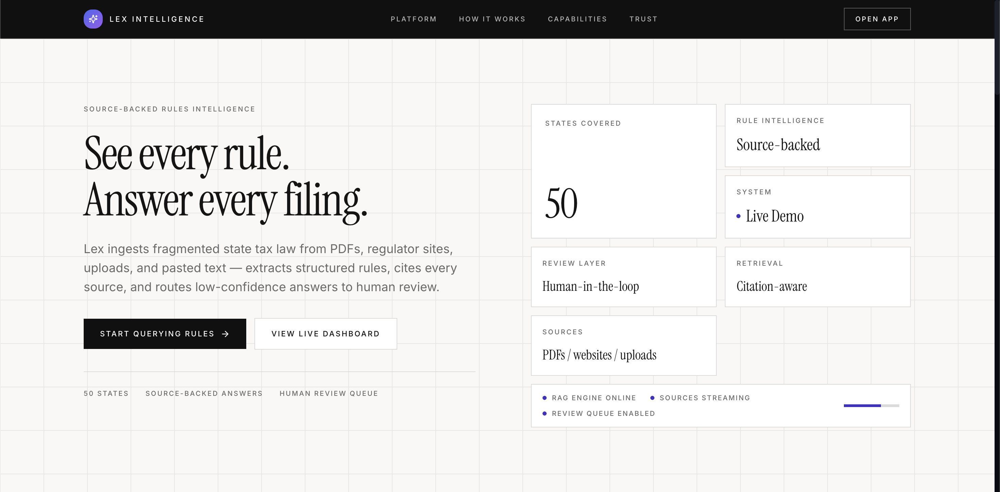
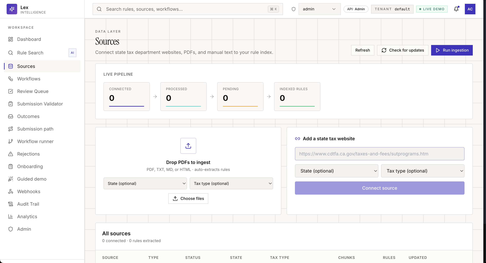
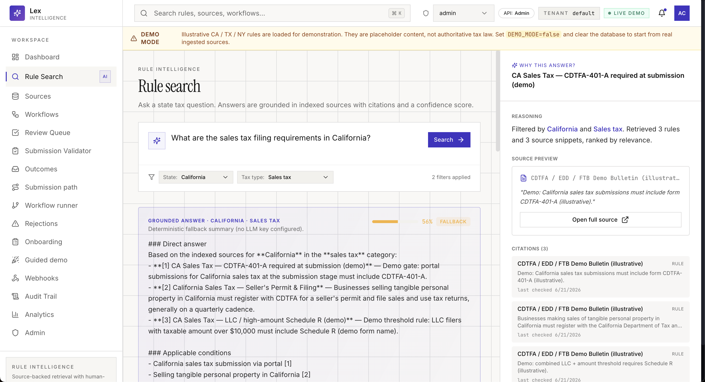
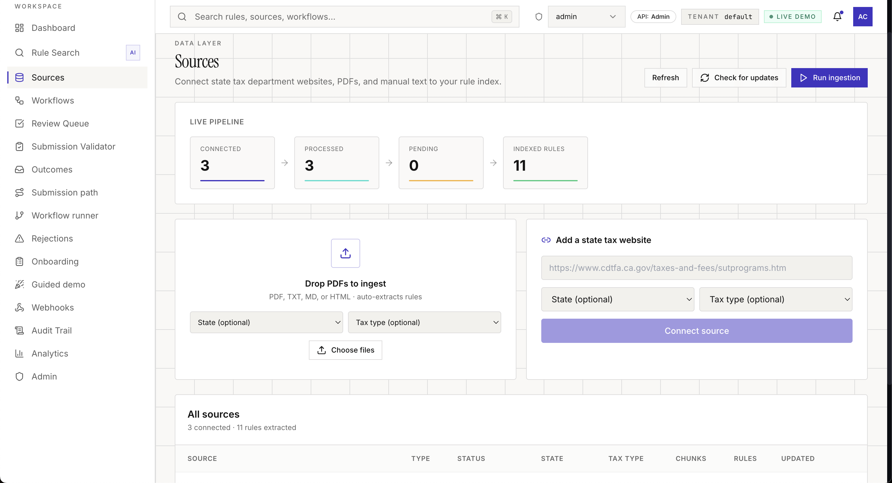
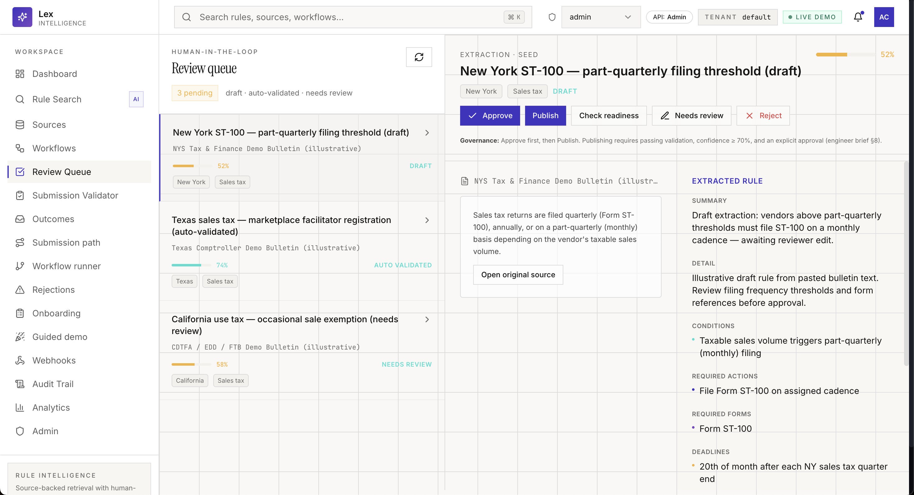
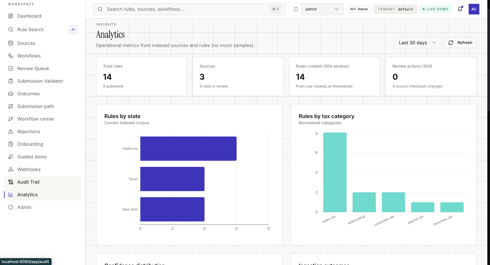
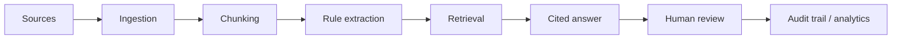

# Lex State Tax Rules Intelligence Platform

Lex is a **source-backed rules intelligence platform** that turns fragmented tax and compliance sources into structured, searchable, cited, reviewable operational workflows.

> **Portfolio prototype. Not legal or tax advice.**  
> Demo data and extracted rules are illustrative. Do not rely on this system for filing, compliance, or legal decisions.



---

## Overview

State and local tax teams work from fragmented sources: regulator websites, PDF bulletins, manuals, uploaded documents, pasted text, and internal notes. Lex ingests those sources, chunks and indexes them, extracts candidate structured rules, and lets operators ask natural-language questions that return **cited answers with confidence scores**.

When extraction or retrieval is uncertain, outputs route to a **human review queue** with approve / reject / publish actions and an audit trail. The product is designed as an intelligence console—not a chatbot wrapper that invents answers without evidence.

## Why this matters

- **Sources are scattered** across PDFs, portals, bulletins, uploads, and ad-hoc text—not one queryable database.
- **Teams need evidence**—citations, source snippets, `last_checked` metadata, and confidence—not prose alone.
- **High-stakes workflows need review**—draft and low-confidence rules should pass human gates before operational use.
- **Auditability matters**—review events, ingestion runs, and structured rule records support traceability.

Lex focuses on **source grounding, structured rule records, retrieval, human review, and analytics** rather than unconstrained LLM chat.

## Screenshots

### Landing Page


### Dashboard



### Rule Search with Source-Backed Answer



### Source Ingestion



### Human Review Queue



### Analytics



## What it does

- **Source ingestion** — PDFs, regulator URLs, pasted text, uploads, and a curated YAML batch list
- **Rule extraction** — hybrid LLM + heuristic extraction with validation signals
- **Retrieval** — lexical, vector, or hybrid ranking over rules and source chunks
- **Cited answers** — responses include rules used, source citations, and snippets
- **Confidence scoring** — transparent scores on answers and extracted rules
- **Human review** — queue for draft / needs-review / auto-validated rules
- **Audit trail** — review events, ingestion runs, and admin audit surfaces
- **Analytics** — rejection coverage, outcomes, and operational KPIs

## Architecture

Modular monolith: one FastAPI backend and one React frontend, with clear service boundaries.

| Layer | Stack |
| --- | --- |
| Frontend | React 18, TypeScript, Vite, Tailwind, shadcn/ui, TanStack Query |
| Backend | Python 3.11, FastAPI, SQLAlchemy 2.x, Pydantic v2 |
| Database | SQLite by default; PostgreSQL via `DATABASE_URL` |
| Ingestion | `requests` + BeautifulSoup (HTML); PyMuPDF / pdfplumber (PDF) |
| Embeddings | Hash-based offline embedder by default; optional OpenAI-compatible embeddings |
| Vector index | In-process NumPy store (`VECTOR_BACKEND=numpy`) |
| LLM | Optional OpenAI-compatible chat endpoint; **deterministic fallback** when no key is set |

See [docs/ARCHITECTURE.md](./docs/ARCHITECTURE.md) for component-level detail.

## Core workflow



1. **Sources** enter via upload, URL, text, or batch YAML ingest.
2. **Ingestion** extracts text, checksums content, and stores `Source` rows.
3. **Chunking** splits text into searchable `SourceChunk` records.
4. **Rule extraction** produces structured `Rule` candidates with confidence.
5. **Retrieval** ranks rules/chunks by query, state, and tax category filters.
6. **Answer generation** assembles a grounded response (LLM or fallback).
7. **Human review** gates uncertain rules before publish.
8. **Audit trail / analytics** records actions and operational signals.

## API surface

Major routes (see `/docs` on a running backend for the full OpenAPI spec):

| Area | Methods | Paths |
| --- | --- | --- |
| Health & meta | GET | `/health`, `/api/health`, `/api/states` |
| Sources | GET, POST, DELETE | `/api/sources`, `/upload`, `/url`, `/text`, `/reindex`, `/{id}/check` |
| Ingestion | POST, GET | `/api/ingest/source`, `/run`, `/runs`, `/runs/{id}` |
| Monitor | POST | `/api/monitor/run`, `/impact` |
| Rules | GET, POST | `/api/rules`, `/{id}`, `/versions`, `/validate`, `/publish-readiness`, `/conflicts` |
| Q&A | POST | `/api/query`, `/api/ask` |
| Review | GET, PATCH, POST | `/api/review/queue`, `/rules/{id}`, `/action`, `/events` |
| Validation & outcomes | POST, GET | `/api/validate-submission`, `/api/outcomes` |
| Dashboard | GET | `/api/dashboard` |
| Analytics | GET | `/api/analytics`, `/rejection-coverage`, `/rejection-patterns` |
| Workflows | GET, POST, PATCH | `/api/workflows/templates`, `/cases`, `/start`, `/advance` |
| Admin & audit | GET | `/api/admin/*`, `/api/audit` |
| Webhooks | GET, POST | `/api/webhooks/*` |
| Platform | GET, POST | `/api/platform/kpis`, `/cache`, `/backfill`, `/governance-config` |
| Demo | POST | `/api/demo/reset` (only when `DEMO_MODE=true`) |

## Technical decisions

- **Source grounding** — Every answer ties back to indexed sources, snippets, and rule records; insufficient evidence triggers a safe fallback message instead of speculation.
- **Confidence scoring** — Helps teams decide when to trust, verify, or escalate to review.
- **Human review** — Publish is gated (approval, validation, confidence threshold in code).
- **Deterministic fallback** — With no `LLM_API_KEY`, ingestion and Q&A still work using heuristics and retrieved rules.
- **Structured rules** — Fields like required forms, deadlines, conditions, and source metadata support search, validation, and workflows—not just raw text search.

## Tradeoffs and limitations

- **Portfolio prototype** — polished UI and end-to-end flows, not a certified compliance product.
- **Not legal or tax advice** — demo seed data is illustrative; real deployments need authoritative sources.
- **Source coverage drives quality** — empty or narrow corpora produce empty or weak answers.
- **Extraction can be wrong** — human review is required for high-stakes use.
- **Lexical-first retrieval at small scale** — hybrid vector retrieval exists but is not a managed vector DB.
- **Some regulator sites** may block simple HTTP ingestion (no Playwright in this repo).

## Documentation

- [Architecture](./docs/ARCHITECTURE.md)
- [RAG pipeline](./docs/RAG_PIPELINE.md)
- [Human review workflow](./docs/HUMAN_REVIEW.md)
- [Project improvements](./docs/PROJECT_IMPROVEMENTS.md)

## Local setup

### Prerequisites

- Python 3.11+
- Node 20+
- (Optional) Docker

### Backend

```bash
cp backend/.env.example backend/.env
cd backend
python -m venv .venv && source .venv/bin/activate
pip install -r requirements.txt
uvicorn app.main:app --reload --port 8000
```

Optional demo seed (illustrative CA / TX / NY rules):

```bash
# in backend/.env
DEMO_MODE=true
```

Delete `backend/rules.db` and restart if you need a fresh seed.

OpenAPI: [http://localhost:8000/docs](http://localhost:8000/docs)

### Frontend

```bash
cd frontend
npm install
npm run dev
```

App: [http://localhost:8080](http://localhost:8080)  
Rule Search: [http://localhost:8080/app/search](http://localhost:8080/app/search)

The Vite dev server proxies `/api/*` and `/health` to port 8000.

### Docker

```bash
docker compose up --build
```

Optional Postgres: `docker compose --profile postgres up --build` with a Postgres `DATABASE_URL`.

### Environment variables

| Variable | Default | Notes |
| --- | --- | --- |
| `DATABASE_URL` | `sqlite:///./rules.db` | Set Postgres URL to switch DBs |
| `LLM_API_KEY` | empty | Optional; fallback mode when unset |
| `LLM_BASE_URL` | OpenAI-compatible URL | Any compatible chat endpoint |
| `LLM_MODEL` | `gpt-4o-mini` | Model name for extraction + answers |
| `DEMO_MODE` | `false` | Seeds illustrative demo rules when `true` |
| `EMBEDDING_PROVIDER` | `hash` | `hash`, `openai`, or `none` |
| `FRONTEND_ORIGIN` | `http://localhost:8080` | CORS allowlist |

See `backend/.env.example` for the full list.

### Tests

```bash
cd backend && pytest
cd frontend && npx tsc --noEmit
```

---

Built as a portfolio demonstration of source-backed rules intelligence: ingestion, retrieval, citations, confidence, and human-in-the-loop review.
