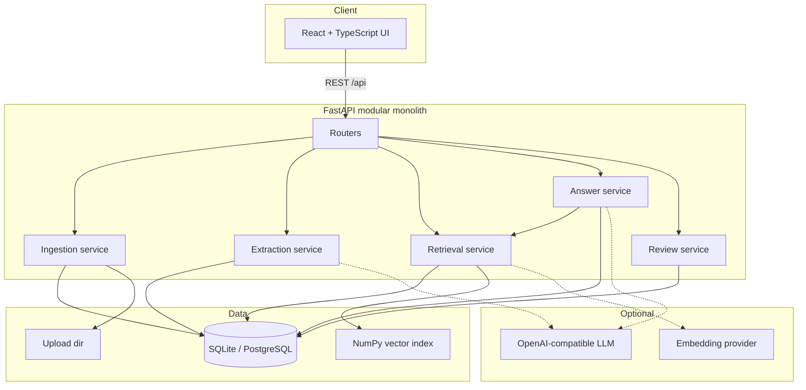

# Architecture

## System overview

Lex is a **modular monolith**: a React frontend talks to a FastAPI backend that orchestrates ingestion, extraction, retrieval, answering, review, and analytics. All persistence goes through SQLAlchemy models backed by SQLite (default) or PostgreSQL.

The design prioritizes **source traceability**—answers and rules link to original documents, snippets, checksums, and review history—not unconstrained text generation.

## Frontend

Single-page app with a marketing landing page and an authenticated-style app shell (demo RBAC role switcher included).

| Area | Route | Purpose |
| --- | --- | --- |
| Landing | `/` | Product positioning, workflow overview |
| Dashboard | `/app` | KPIs, activity feed, change alerts |
| Rule Search | `/app/search` | Natural-language Q&A with citations |
| Sources | `/app/sources` | Upload, URL, text ingest, batch run, monitor |
| Review Queue | `/app/review` | Human review of extracted rules |
| Workflows | `/app/workflows` | Case workflow templates and runner |
| Analytics | `/app/analytics` | Rejection coverage and patterns |
| Admin / Audit | `/app/admin`, `/app/audit` | Taxonomy, summary, audit log |
| Validation / Outcomes | `/app/validate`, `/app/outcomes` | Deterministic submission checks |

Shared layout: light editorial sidebar, top search bar, TanStack Query for API calls (`frontend/src/lib/api.ts`).

## Backend

**Routers** (`backend/app/routers/`) validate requests and delegate to services.  
**Services** (`backend/app/services/`) hold business logic.  
**Models / schemas** (`models.py`, `schemas.py`) define persistence and API contracts.

Key services:

| Service | Responsibility |
| --- | --- |
| `ingestion_service` | Fetch/parse PDFs and HTML, checksum dedupe, chunk storage |
| `extraction_service` | Hybrid LLM + heuristic rule extraction |
| `retrieval_service` | Lexical / vector / hybrid ranking |
| `answer_service` | Retrieve → generate → cite → persist `Answer` |
| `review_service` | Approve, reject, publish, edit with `ReviewEvent` audit |
| `monitor_service` | Re-fetch URLs, compare checksums, re-ingest on change |
| `rule_engine` | Deterministic submission validation (no LLM) |

## Data model

Core entities in the codebase:

| Entity | Role |
| --- | --- |
| `Source` | Ingested document or URL with checksum, status, metadata |
| `SourceChunk` | Searchable text segment tied to a source |
| `Rule` | Structured rule record with confidence, review status, source linkage |
| `Question` | Stored user question |
| `Answer` | Grounded response with method, confidence, retrieval metadata |
| `ReviewEvent` | Audit row for review actions |
| `IngestionRun` | Batch or monitor run history |
| `OutcomeEvent` | Submission outcome / rejection feedback |

Additional governance tables include `Jurisdiction`, `ProgramVariantDef`, `RejectionReason`, workflow templates, webhook subscriptions, and audit logs.

## Retrieval and answer flow

1. Client sends `POST /api/query` with `question`, optional `state`, `tax_type`.
2. `answer_service` tokenizes the question and calls `retrieval_service`.
3. Retrieval filters by tenant, state, tax category, and review status; ranks rules and chunks (lexical, vector, or hybrid).
4. If evidence is insufficient, a canned safe response is returned.
5. Otherwise an LLM (if configured) or **deterministic fallback** summarizes top rules.
6. Response includes `rules_used`, `sources`, `confidence`, `method`, and persisted `question_id`.

## Human review flow

Extracted rules start in statuses such as `draft`, `auto_validated`, or `needs_review`. The review queue lists rules not yet published. Reviewers can **edit**, **approve**, **reject**, **publish**, or send back to **needs_review**. Publish checks validation and confidence gates in code. Each action writes a `ReviewEvent`.

## Deployment shape

- **Local prototype** — `uvicorn` + Vite dev server (documented in README).
- **Docker Compose** — `docker-compose.yml` builds backend + frontend; optional Postgres profile.
- **No cloud deployment** is configured in this repository.

## Reliability considerations

| Mechanism | Purpose |
| --- | --- |
| Deterministic fallback | Q&A and enforcement work without external LLM keys |
| Source checksums | Skip duplicate ingests; detect URL content changes on monitor runs |
| Evidence sufficiency check | Avoid generating answers when retrieval is empty |
| Review gates | Publish requires approval + validation + confidence threshold |
| Review events & audit log | Trace who changed what and when |
| Idempotent demo seed helpers | `ensure_demo_*` functions avoid duplicate seed rows |
| Failure modes | Ingestion marks sources `failed` with error messages; weak retrieval returns explicit empty-state responses |
